# numtmath
Python module for working with several number theory concepts. Started as a personal project for work in number theory problems

## _Installation_

You can install this module using pip

`
pip install numtmath
`

## _Important functions_
- help() Lists names of all available functions

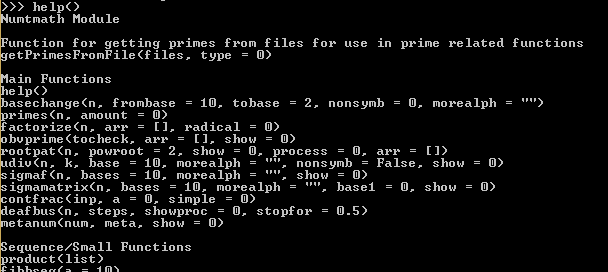 </img>
- primes(n, amount) (Slow algorithm) outputs prime numbers from 2 to n.
  - If amount = 1 - outpunts n amount of primes

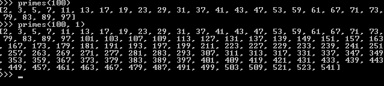 </img>
- getPrimesFromFile() create list with prime numbers from files from 

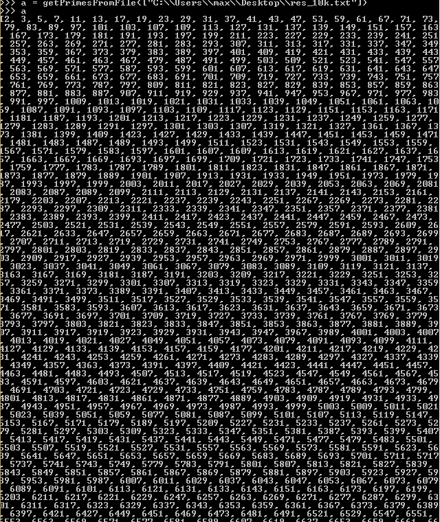 </img>
- basechange(n, frombase, tobase, nonsymb, morealph) Converts a number from one base/radix to another
  - frombase - original base, 10 is default
  - tobase   - resulting base, 2 is default
  - nonsymb  - if 1, result will be in nonsymbolic representation
  - morealph - Accepts string that can be used to increase largest possible base

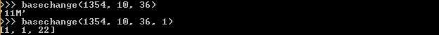 </img>
- factorize(n, arr, radical) preforms prime factorisation
  - arr - accepts list of primes to make factorisation much faster
  - radical - if 1, includes only unique primes in resulting list

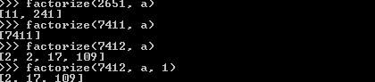 </img>
- udiv(n, k, base, morealph, nonsymb, show) python implementation of ultradivider read https://github.com/MaxSaganyuk/Ultradivider
  - base - resulting base
  - morealph - Accepts string that can be used to increase largest possible base
  - nonsymb - if 1, result will be in nonsymbolic representation
  - show - if 1, uses alternative way to show the result

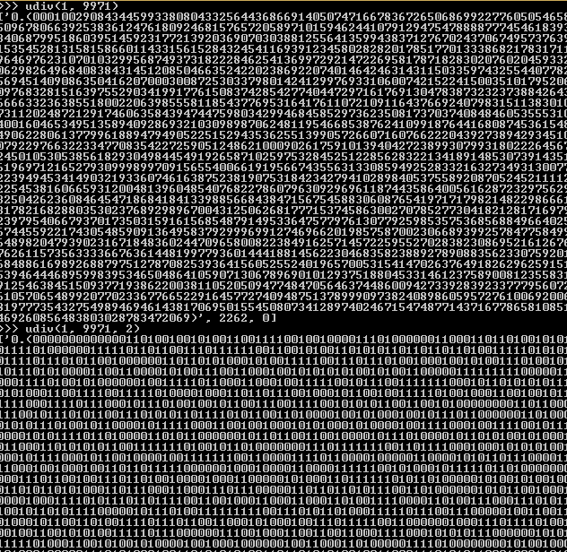 </img>
- gencollatz(n, a, b, top, checkForCicle) tool for Generalized Collatz conjecture 

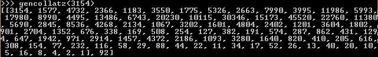 </img>
- riemannzeta(n, a, giveall) UNFINISHED 
- revtaxi(n, am, r)

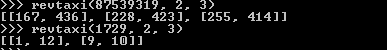 </img>
- metanum(num, meta, show)
  - num - a number in form of a string
  - meta - a number to look for inside other number
  - show - if 1, uses alternative way to show the result

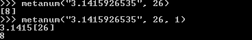 </img>
- contfrac(inp, a, simple) If number is inputed - creates list that represents continued fraction. If list is inputed - ta
  - l

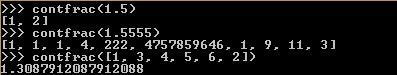 </img>
- fibbseq(a) returns Fibbonacci sequence in size a

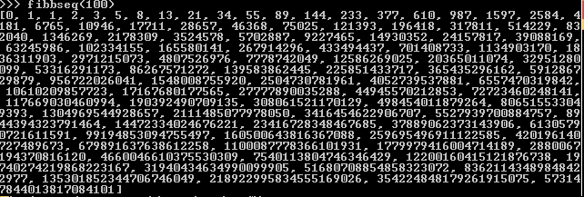 </img>
- powseq(n, a, inv_n) returns the

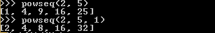 </img>
- product(list) multiplies every number in the list
  - list

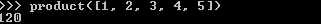 </img>
- disintseq(seq, show)
  - seq - 
  - show - if 1, uses alternative way to show the result

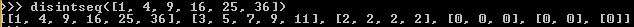 </img>
## _Other functions_
- obvprime(tocheck, arr, show) read 
  - arr - accepts list of primes to make factorisation much faster
  - show - if 1, uses alternative way to show the result

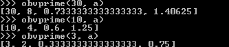 </img>
- rootpat(n, powroot, show, process, arr)

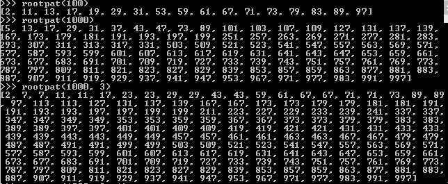 </img>
- sigmaf(n, bases, morealph, show)
  - bases - resulting bases form 2 to N
  - morealph - Accepts string that can be used to increase largest possible base
  - show - if 1, uses alternative way to show the result

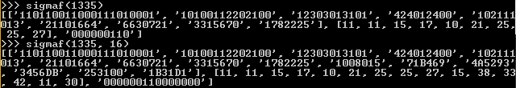 </img>
- sigmamatrix(n, bases, morealph, base1, show) shows result for sigma project in a "matrix" form

## _LateX functions_
Requires pylatex to work, so they are seperated to other version of the module numtmath_latex.py. Can't be installed by pip - download form this repository
- contfractex(inp, a) creats pdf file with continued fraction
- recfractex(n)
